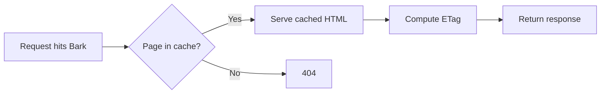
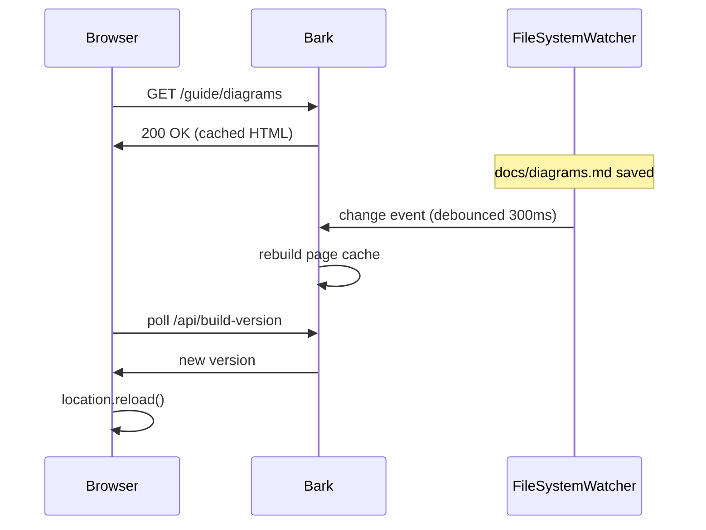
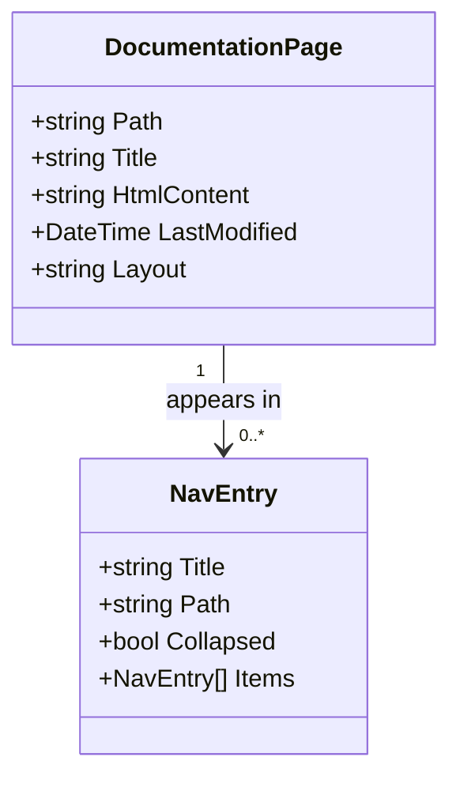
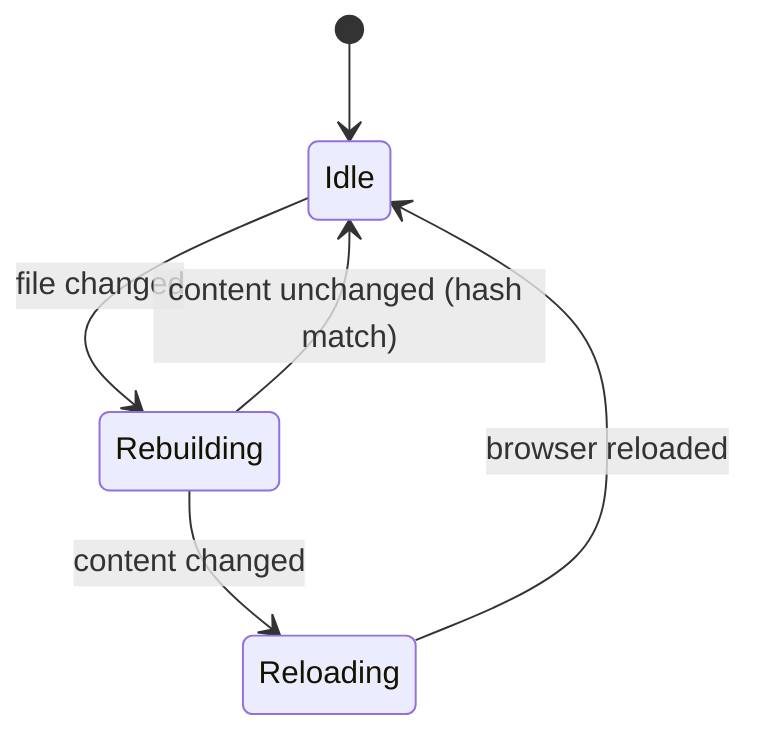
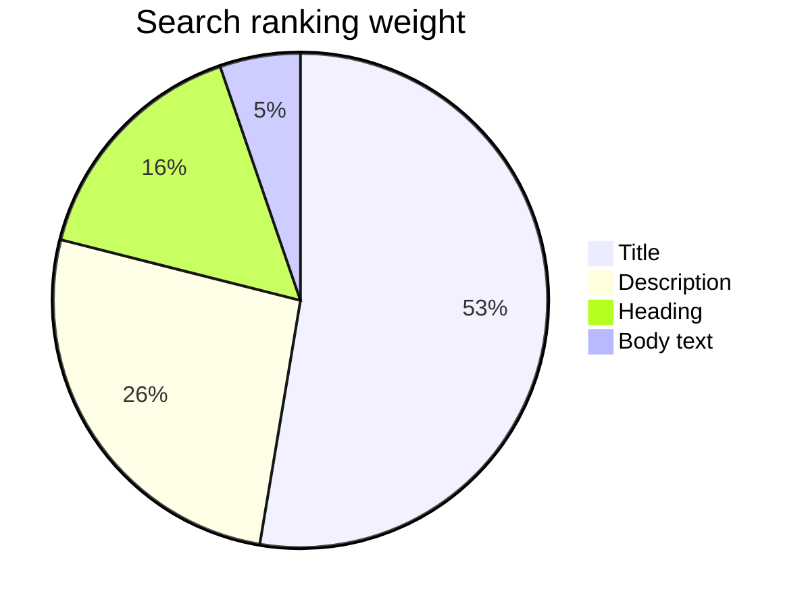

# Using Diagrams

Fenced code blocks with the `mermaid` language identifier render as diagrams.

No plugins or build steps are required. `mermaid.js` loads once per page and replaces each block with an SVG after page load.

## Flowchart

````md

````


## Sequence diagram



## Class diagram

Data model example:



## State diagram



## Pie chart



Diagrams render client-side. They are absent from the HTML source, from text-only crawlers, and from `llms.txt`. Content essential to understanding must also appear in the surrounding text, which also provides a text alternative for assistive technology.

::: note
Diagram colors come from the active theme palette. Mermaid bakes colors into the SVG instead of using CSS variables, so toggling dark mode on a page with diagrams triggers a full reload.
:::
